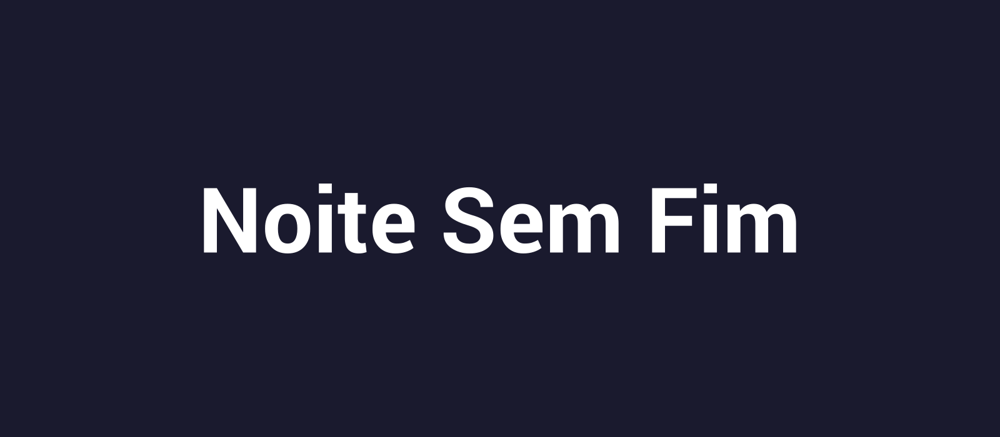

<h1 align="center">🎬 Netflix Profiles Clone</h1>

<p align="center">
  Clone estático da tela de seleção de perfis e da página inicial da Netflix, desenvolvido como atividade avaliativa (P1) da disciplina de Frontend.
</p>

<p align="center">
  
  
  
</p>

<p align="center">
  
</p>

## 📖 Sobre o projeto

Este projeto reproduz, de forma estática e apenas para fins didáticos, as principais telas da interface da Netflix:

- Seleção de perfis ("Quem está assistindo?")
- Gerenciamento de perfis (modo de edição visual)
- Página inicial com banner em destaque e fileiras de catálogo

Não possui qualquer vínculo com a Netflix, Inc. Todas as imagens de filmes são placeholders fictícios, usados apenas para compor o layout.

## ✨ Funcionalidades

- [x] Tela de seleção com 4 perfis de usuário
- [x] Navegação entre perfil → página inicial do catálogo
- [x] Página inicial com banner em destaque e fileiras de títulos
- [x] Tela de gerenciamento de perfis (edição apenas visual)
- [x] Totalmente responsivo a diferentes tamanhos de tela

## 🛠️ Tecnologias utilizadas

| Tecnologia | Uso |
|---|---|
| HTML5 | Estruturação semântica das páginas |
| CSS3 | Estilização, grid/flexbox e efeitos de hover |

> Projeto construído propositalmente sem JavaScript, como exercício de fundamentos de HTML e CSS.

## 📁 Estrutura do projeto

```
netflix-profiles-p1/
├── assets/
│   ├── posters/        # Pôsteres fictícios usados no catálogo
│   ├── banner.png       # Banner em destaque da home
│   ├── netflix-logo.svg
│   └── perfilX.png      # Avatares dos perfis
├── index.html           # Tela "Quem está assistindo?"
├── editar.html          # Tela de gerenciamento de perfis
├── navegar.html         # Página inicial / catálogo
├── style.css            # Estilos globais
└── README.md
```

## 🚀 Como executar

Não há dependências ou processo de build. Basta clonar o repositório e abrir o arquivo `index.html` no navegador:

```bash
git clone https://github.com/plfrancisco/netflix-profiles-p1.git
cd netflix-profiles-p1
```

Depois, abra o arquivo `index.html` com duplo clique ou pela extensão **Live Server** do VS Code.

## 👥 Autores

| Nome | GitHub |
|---|---|
| Pedro Lucas Francisco | [@plfrancisco](https://github.com/plfrancisco) |
| Nathália Rodrigues Moraes | — |

## 📄 Licença

Projeto acadêmico sem fins comerciais, distribuído apenas para fins de estudo.
